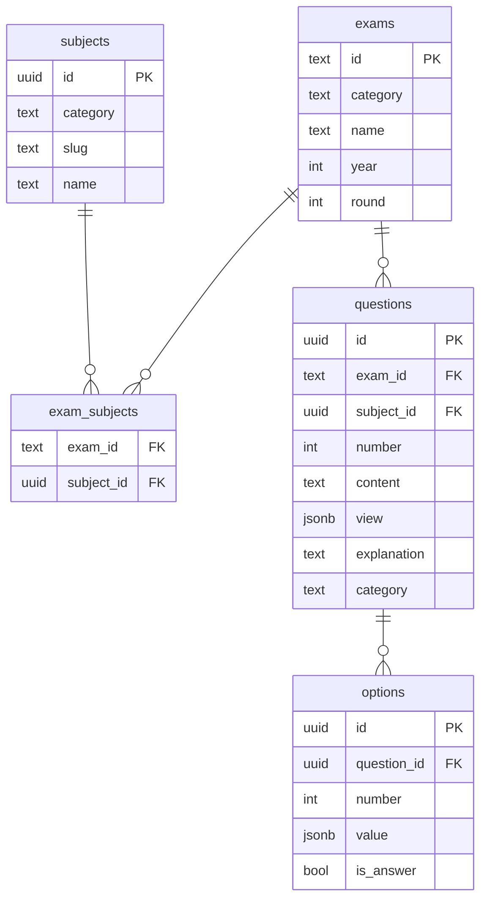

# DB Schema

## 테이블 관계

---

## 테이블 정의

### exams

| 컬럼 | 타입 | 제약 |
|------|------|------|
| id | text | PK |
| category | text | NOT NULL |
| name | text | NOT NULL |
| year | int | NOT NULL |
| round | int | NULL 허용 |

UNIQUE(category, year, round)

---

### subjects

| 컬럼 | 타입 | 제약 |
|------|------|------|
| id | uuid | PK |
| category | text | NOT NULL |
| slug | text | NOT NULL |
| name | text | NOT NULL |

---

### exam_subjects

| 컬럼 | 타입 | 제약 |
|------|------|------|
| exam_id | text | FK → exams.id |
| subject_id | uuid | FK → subjects.id |

PK(exam_id, subject_id)

---

### questions

| 컬럼 | 타입 | 제약 |
|------|------|------|
| id | uuid | PK |
| exam_id | text | FK → exams.id, NOT NULL |
| subject_id | uuid | FK → subjects.id, NOT NULL |
| number | int | NOT NULL |
| content | text | NOT NULL |
| view | jsonb | NULL 허용 |
| explanation | text | NOT NULL |
| category | text | NOT NULL |

---

### options

| 컬럼 | 타입 | 제약 |
|------|------|------|
| id | uuid | PK |
| question_id | uuid | FK → questions.id, NOT NULL |
| number | int | NOT NULL |
| value | jsonb | NOT NULL |
| is_answer | bool | NOT NULL |

> `value` 컬럼은 OptionBlock 구조를 저장. `{ type: "text", content: string }` 또는 `{ type: "image", url: string, alt?: string }`

---

## ViewBlock 구조 (questions.view)

`view` 컬럼은 ViewBlock 배열을 저장. 문제 지문을 구성하는 블록 목록. 하나의 문제에 여러 블록이 순서대로 조합될 수 있다.

| type | 구조 | 설명 |
| ---- | ---- | ---- |
| `text` | `{ type: "text", content: string }` | 일반 텍스트 |
| `list` | `{ type: "list", items: string[] }` | 항목 나열 |
| `image` | `{ type: "image", url: string, alt?: string }` | 이미지 |
| `table` | `{ type: "table", rows: string[][] }` | 표 |
| `labeled-list` | `{ type: "labeled-list", items: [{ label: string, content: string }] }` | 기호·문자 레이블이 붙은 항목 나열 (예: ㄱ. ㄴ. / a. b.) |

---

## RLS 정책

- 전 테이블 read-only public
- 쓰기는 service_role_key로만 허용
